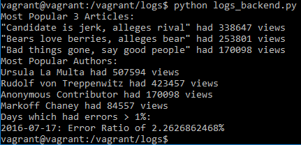

Running the script
- Install Virtual Box
- Install vagrant
- Download the FullStack Nanodegree VM (not distributed incase of potential copyright) and extract the zip, the extracted zip location will be referred hereafter as '$VM'
- Create a directory for the log database and the python code, run the following in a terminal: ```mkdir $VM/vagrant/logs```
- Download the database zip (not distributed incase of potential copyright) and extract the contents to ```$VM/vagrant/logs```, thus the following file should exist: ```$VM/vagrant/logs/newsdata.sql```
- Now we download the python script ```logs_backend.py``` and place it in ```$VM/vagrant/logs```, thus the following file should exist: ```$VM/vagrant/logs/logs_backend.py```
- The files are setup so we can log into the VM and run the script
- Open a terminal and run the following commands
- Go to the VM directory: ```cd $VM/vagrant```
- Setup Vagrant: ```vagrant up```
- Log into the VM: ```vagrant ssh```
- Go to the logs folder: ```cd /vagrant/logs```
- Run the Python script: ```python logs_backend.py```

The program was designed using a single class, LogDatabase, to handle everything. The idea behind this class was to create something handling all the internal stuff (connection and queries to the database), so an external user could easy take this and use it without any knowledge of databases.

Changes after first code review:
- Added ```#! /usr/bin/env python3```
- Error ratio now prints in percentage rather than decimal
- Refactored some functionality of the LogDatabase class to be internal rather than external
- LogDatabase handles connection failures
- LogDatabase test code doesn't run if the file is imported
- Additional installation instructions
- Added screenshot to README